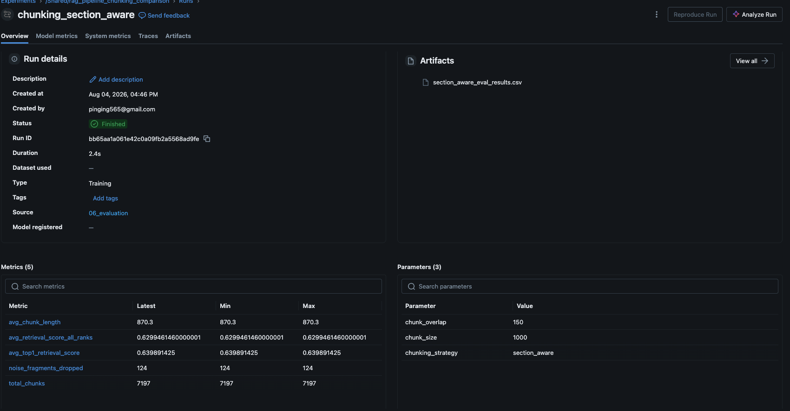

# Enterprise RAG & AI Agent Pipeline with Unity Catalog

A production-style Retrieval-Augmented Generation (RAG) system built on **Databricks Free Edition**, showcasing distributed data engineering and governed GenAI infrastructure. This project extends prior RAG work (a local ChromaDB + GPT-4o mini prototype) into a scalable, production-grade pipeline using Unity Catalog, Spark, Vector Search, MLflow, and an agentic tool-calling layer.

## Project Motivation

Most portfolio RAG projects stop at "local script + vector DB." This project instead demonstrates the full production stack a real enterprise GenAI system requires: governed data storage, distributed processing, managed vector search, experiment tracking, and an agent layer that can search, reformulate, and — critically — recognize when it doesn't have enough grounding to answer honestly.

## Corpus

**15 SEC 10-K filings** across 5 major tech companies, 3 fiscal years each (2023–2025), sourced directly from SEC EDGAR:

| Company | Ticker | Years |
|---|---|---|
| NVIDIA | NVDA | 2023, 2024, 2025 |
| Apple | AAPL | 2023, 2024, 2025 |
| Microsoft | MSFT | 2023, 2024, 2025 |
| Meta | META | 2023, 2024, 2025 |
| Alphabet (Google) | GOOG | 2023, 2024, 2025 |

Files follow the naming convention `TICKER_YEAR_10K.pdf`. Note: NVIDIA's fiscal year ends in late January rather than December, so `NVDA_2025` corresponds to a period ending January 2025, not calendar year 2025.

## Architecture

```
Raw PDFs (Volume)
      │
      ▼
Bronze: PDF text extraction (pypdf)
      │
      ▼
Silver: Chunking  ──┬── Fixed-size chunking (1000 chars, 150 overlap)  ← selected strategy
                    └── Section-aware chunking (split on "Item X" headers)
      │
      ▼
Silver: Embeddings (databricks-bge-large-en, 1024-dim)
      │
      ▼
Vector Search: Two Delta Sync Indexes (one per chunking strategy)
      │
      ▼
Agent: Tool-calling loop (search → evaluate → reformulate/retry → grounded answer)
      │
      ▼
Final Answer (with source citations, or an honest "insufficient information" response)
```

Governance is handled throughout via **Unity Catalog** — all tables and volumes live under the `rag_pipeline.main` schema, giving a consistent, permissioned three-level namespace (`catalog.schema.object`) from raw files through to the vector index. Experiment results are tracked in **MLflow** for reproducibility.

## Tech Stack

- **Compute**: Databricks Free Edition, serverless only (no GPU support)
- **Storage & Governance**: Unity Catalog (Volumes for raw files, Delta tables for structured data)
- **Processing**: PySpark, including `pandas_udf` for distributed embedding calls
- **Embeddings**: Databricks-hosted foundation model endpoint (`databricks-bge-large-en`, 1024 dimensions)
- **Vector Search**: Databricks AI Search (formerly "Vector Search"), Delta Sync Indexes, Hybrid index type
- **LLM / Agent**: `databricks-gpt-oss-120b` via Databricks' AI Gateway (OpenAI-compatible client), with function-calling tool use
- **Experiment Tracking**: MLflow (chunking strategy comparison, logged as a full experiment with params/metrics/artifacts)
- **Version Control**: GitHub

## Repository Structure

```
enterprise-rag-unity-catalog/
├── README.md
├── notebooks/
│   ├── 01_ingestion.ipynb
│   ├── 02_chunking.ipynb
│   ├── 03_embeddings.ipynb
│   ├── 04_vector_search_setup.ipynb
│   ├── 05_agent.ipynb
│   └── 06_evaluation.ipynb
├── src/
├── config/
└── docs/
    └── images/
        ├── mlflow_fixed_size.webp
        └── mlflow_section_aware.png
```

## Notebook-by-Notebook Breakdown

### `01_ingestion.ipynb` — Bronze Layer
Reads all 15 PDFs from the Unity Catalog Volume `rag_pipeline.main.raw_documents`, extracts raw text using `pypdf`, and parses `company` and `fiscal_year` metadata directly from each filename. Writes the result to `rag_pipeline.main.bronze_10k_filings`.

**Result**: 15 rows, all filings extracted cleanly (200K–540K characters each, no failures).

### `02_chunking.ipynb` — Silver Layer (Chunking)
Splits each filing's raw text into retrieval-sized passages using two competing strategies:

- **Fixed-size chunking** (`chunking_strategy = "fixed_size_1000"`): mechanically splits text into 1000-character chunks with 150-character overlap. Written to `rag_pipeline.main.silver_chunks_fixed_size`.
- **Section-aware chunking** (`chunking_strategy = "section_aware"`): splits first on 10-K "Item X" section headers (regex-based), then sub-chunks any section still over 1000 characters. Written to `rag_pipeline.main.silver_chunks_section_aware`.

Both apply a `MIN_CHUNK_LENGTH = 30` filter to remove near-empty junk fragments.

**Result**: 6,457 clean fixed-size chunks (avg 998 chars) vs. 7,197 clean section-aware chunks (avg 870 chars). Section-aware chunking produced significantly more noise before filtering — 124 junk fragments (1.7%) caused by the header regex false-matching on table-of-contents entries and in-text cross-references, versus only 2 junk fragments (0.03%) for fixed-size.

### `03_embeddings.ipynb` — Silver Layer (Embeddings)
Generates a 1024-dimension vector embedding for every chunk in both Silver tables using `databricks-bge-large-en`, distributed via a `pandas_udf` across Spark partitions with internal batching (20 texts per API call). Writes to `rag_pipeline.main.silver_embeddings_fixed_size` and `rag_pipeline.main.silver_embeddings_section_aware`.

**Result**: 6,457 and 7,197 embedded rows respectively, matching chunk counts exactly.

### `04_vector_search_setup.ipynb` — Vector Search Indexing
Enables Change Data Feed on both embedding tables, then creates two Hybrid-type Delta Sync Indexes on a shared AI Search endpoint (`rag_pipeline_endpoint`) — `fixed_size_index` and `section_aware_index` — using pre-computed embeddings with `chunk_id` as the primary key.

### `06_evaluation.ipynb` — Chunking Strategy Comparison
Runs 8 test queries — spanning single-document, cross-year, and cross-company query types — against both indexes, logging retrieved chunks and similarity scores to `rag_pipeline.main.eval_retrieval_results`, and formally tracked as an **MLflow experiment** (`rag_pipeline_chunking_comparison`) with two runs, one per strategy.

**Key finding**: Fixed-size and section-aware chunking produced nearly identical retrieval quality (avg top-1 similarity: 0.6429 fixed-size vs. 0.6399 section-aware), with fixed-size holding a small, consistent edge across every query type (cross-company, cross-year, and single-doc). This is best explained by the fact that most content-dense 10-K sections (Item 1A Risk Factors, Item 7 MD&A) are long enough to be sub-chunked identically by both strategies regardless of the initial split method. **Given comparable retrieval quality and meaningfully lower noise, fixed-size chunking was selected as the primary strategy for the production pipeline.**

**MLflow experiment evidence:**

*Fixed-size chunking run — 0.6429 avg top-1 score, 2 noise fragments dropped:*


*Section-aware chunking run — 0.6399 avg top-1 score, 124 noise fragments dropped:*


### `05_agent.ipynb` — Agent & Tool-Calling
Implements a full agentic RAG loop using `databricks-gpt-oss-120b`, exposed as an OpenAI-compatible function-calling model. Unlike a fixed retrieve-then-generate pipeline, the agent:

1. Receives a user question and decides whether/how to search a `search_10k_filings` tool (wrapping the fixed-size Vector Search index).
2. **Can reformulate and retry** its search query across multiple turns if the first attempt doesn't return relevant chunks — observed in testing to try up to 4 different docsquery phrasings (including exact SEC filename conventions like `meta-20231231`) before concluding.
3. Synthesizes a final, cited answer grounded strictly in retrieved passages — or explicitly states when the corpus doesn't contain sufficient information, rather than guessing.

**Validated behaviors:**
- ✅ Correctly grounded, well-cited answers for well-covered topics (e.g., NVIDIA supply chain risk, cross-company AI competition risk comparison)
- ✅ Correct refusal on genuinely out-of-scope questions (e.g., "NVIDIA's plan for entering the automotive insurance market" — correctly identified the corpus only covers NVIDIA's actual DRIVE/automotive-computing business)
- ✅ Multi-turn query reformulation when initial retrieval misses the target content

**Critical finding — hallucination under weak retrieval:**
During testing, a query about Meta's regulatory risk disclosure changes (2023 vs. 2025) returned only administrative/boilerplate chunks (share counts, auditor procedures, filing legalese) rather than actual risk-factor content. Under an early, loosely-worded "provide your best answer now" forced-synthesis instruction, the agent **fabricated a detailed, plausible-sounding, fully hallucinated answer** — including specific fake dollar figures ("$210 million accrual"), fake percentages, and fake citation tags — none of which existed in the retrieved chunks. This was caught by explicitly logging and inspecting the actual chunks passed to the model.

**Fix applied**: the system prompt was strengthened to explicitly require that (a) every specific fact/figure be traceable to retrieved text, (b) the model refuse to fill gaps with plausible-sounding general knowledge, and (c) citation-style tags only be used when quoting text genuinely present in context. Re-running the identical query afterward produced an honest response acknowledging the retrieved passages only pointed to the existence of a "Risk Factors" section without containing its substantive text — a correct, non-hallucinated answer despite the same underlying retrieval limitation.

This is treated as a first-class finding of the project, not a hidden bug: **it demonstrates a real, common RAG failure mode (confident fabrication under weak retrieval) and a concrete, tested mitigation.** Prompt-based grounding reduces but does not guarantee elimination of this risk — a limitation worth stating plainly rather than overselling.

## Setup Notes & Constraints

- Databricks Free Edition is a **permanent** free tier (not a time-limited trial), including one Unity Catalog metastore, one AI Search endpoint (one search unit), CPU-only Model Serving, and serverless-only compute.
- Outbound internet from notebooks is restricted to a trusted-domain allowlist — external documents (e.g., SEC EDGAR filings) must be downloaded locally and uploaded through the UI rather than fetched directly from a notebook.
- LLM access is via Databricks' pay-per-token Foundation Model APIs / AI Gateway, callable through an OpenAI-compatible client at no cost within Free Edition's fair-use limits.
- Free Edition is intended for non-commercial use, which this portfolio project satisfies.

## Known Limitations

- Retrieval sometimes surfaces boilerplate/administrative filing text (share counts, auditor procedures) instead of substantive risk-factor content for certain query phrasings — a limitation of the current embedding/retrieval setup for this corpus, not fully solved by query reformulation alone.
- Prompt-based hallucination mitigation is a partial safeguard, not a guarantee, when retrieved context is weak or off-topic.
- Section-aware chunking's regex-based section splitting is sensitive to each filing's exact TOC/cross-reference formatting and would need refinement to be more reliable across a larger or more heterogeneous corpus.

